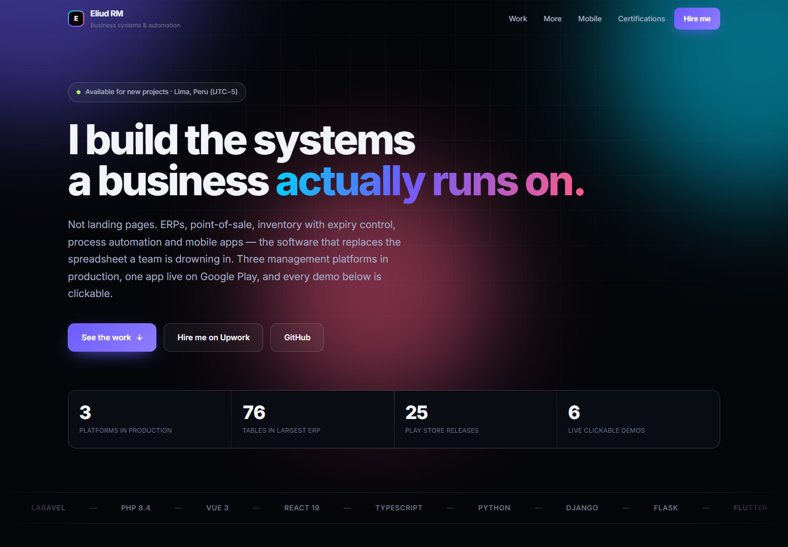
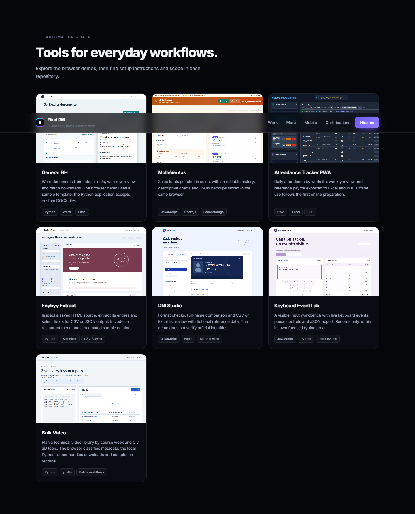

<div align="center">

# Eliud Rojas Mendoza

A portfolio of business systems, automation tools and mobile applications, with project views and access to interactive demos.

<a href="https://enybyy.github.io/"></a>

<p><a href="https://github.com/Enybyy"></a>
<a href="https://www.linkedin.com/in/eliud-rojas-mendoza-414652212/"></a>
<a href="https://www.upwork.com/freelancers/~01471ca462b236e8e5"></a></p>

[](https://enybyy.github.io/)

*Actual portfolio website screenshot.*

[About](#about-the-project) · [Workflow](#everyday-workflow) · [Technology](#built-with) · [Run locally](#local-use)

</div>


## About the project

Business systems, automation tools and mobile applications each have a different workflow. This website brings them together through interface screenshots and demo links, allowing visitors to explore each case through the product and then its documentation.

The gallery connects the tools to everyday tasks: preparing documents, reviewing lists, recording shifts, tracking attendance and turning pages into data. Public repositories provide setup instructions and scope; private projects are presented through their views and descriptions.

## Everyday workflow

| Inside the portfolio | Detail |
| --- | --- |
| Business applications | Views of management systems, commerce and mobile applications. |
| Working tools | Seven public demos covering documents, records, attendance and data. |
| Project material | Authentic interface screenshots and links to available source code. |
| Navigation | Responsive layout and navigation between portfolio sections. |

## Screenshots

### Portfolio tools and demos



## Projects with demos

| Project | Repository | Demo |
| --- | --- | --- |
| DNI Studio | [Source](https://github.com/Enybyy/dni-identity-validator) | [Open](https://enybyy.github.io/dni-identity-validator/) |
| Keyboard Event Lab | [Source](https://github.com/Enybyy/keyboard-event-lab) | [Open](https://enybyy.github.io/keyboard-event-lab/) |
| MolleVentas | [Source](https://github.com/Enybyy/pos-sales-management-system) | [Open](https://enybyy.github.io/pos-sales-management-system/) |
| Enybyy Extract | [Source](https://github.com/Enybyy/web-scraping-selenium-pipeline) | [Open](https://enybyy.github.io/web-scraping-selenium-pipeline/) |
| Generar RH | [Source](https://github.com/Enybyy/rh-document-generator) | [Open](https://enybyy.github.io/rh-document-generator/) |
| Bulk Video | [Source](https://github.com/Enybyy/descargar-videos-bulk) | [Open](https://enybyy.github.io/descargar-videos-bulk/) |
| Attendance Tracker PWA | [Source](https://github.com/Enybyy/attendance-tracker-pwa) | [Open](https://enybyy.github.io/attendance-tracker-pwa/) |

## Built with

| Area | Technology |
| --- | --- |
| Website | HTML, CSS and JavaScript |
| Hosting | GitHub Pages |
| Visual material | Actual project screenshots |
| Website typography | Inter |

## Local use

<details>
<summary><strong>Run on your computer</strong></summary>

The website consists of static files. From the repository folder:

```bash
python -m http.server 5087 --bind 127.0.0.1
```

Open http://127.0.0.1:5087. The root contains `index.html`; `assets/` contains styles, scripts and images. GitHub Pages publishes the website from the main branch.

</details>

---

<div align="center">

**Eliud Rojas Mendoza · Enybyy**

<p><a href="https://github.com/Enybyy"></a>
<a href="https://www.linkedin.com/in/eliud-rojas-mendoza-414652212/"></a>
<a href="https://www.upwork.com/freelancers/~01471ca462b236e8e5"></a></p>

</div>
