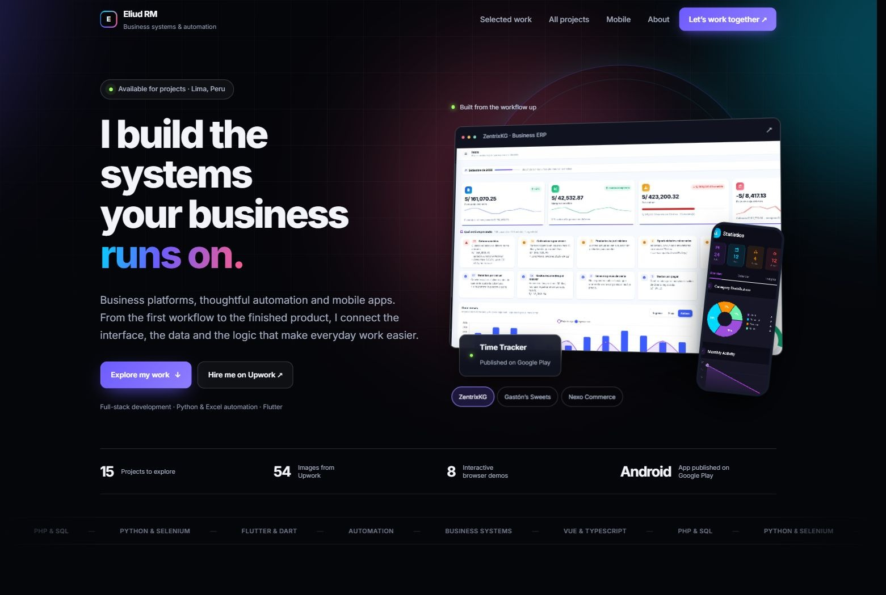

# Eliud Rojas Mendoza · Developer portfolio

[Visit the portfolio](https://enybyy.github.io/) · [Upwork](https://www.upwork.com/freelancers/~01471ca462b236e8e5) · [GitHub](https://github.com/Enybyy)

A portfolio of business systems, automation tools and mobile applications, built around authentic interfaces and clear project scope.



## Explore the work

- **15 projects**, organized by business systems, automation and data, mobile apps, and web experiences.
- **54 images from the 13 Upwork portfolio entries**, plus two images of the historical contract prototype. All are available in project galleries.
- Three selected case studies: ZentrixKG, Gastón’s Sweets, and Nexo Commerce.
- A published Android app, Time Tracker, and Heavy Duty clearly marked as in development.
- Eight browser demos, including a local Hotkey Workbench preview.
- Project search, category filters, keyboard gallery controls, and responsive navigation.
- Entrance animations, ambient gradients, gallery transitions, and hover effects. Reduced-motion preferences are respected.

## Scope and sources

Descriptions were reconciled with the available GitHub READMEs and Upwork portfolio entries. Published products, interactive demonstrations, historical prototypes and development work keep their own status.

MolleVentas is described as shift sales tracking and revenue charts; it does not claim unsupported stock, purchasing or expense modules. Contract Automation System is the historical upload prototype that led to Generar RH. The Hotkey Workbench browser preview visualizes a sequence and does not send input to other applications.

Images are optimized WebP copies of authentic project captures. Long images retain their full proportions in the detailed gallery; covers use a crop. Each image can also be opened separately.

## Browser demos

| Project | Demo | Source |
| --- | --- | --- |
| Attendance Tracker | [Open](https://enybyy.github.io/attendance-tracker-pwa/) | [Repository](https://github.com/Enybyy/attendance-tracker-pwa) |
| Generar RH | [Open](https://enybyy.github.io/rh-document-generator/) | [Repository](https://github.com/Enybyy/rh-document-generator) |
| Enybyy Extract | [Open](https://enybyy.github.io/web-scraping-selenium-pipeline/) | [Repository](https://github.com/Enybyy/web-scraping-selenium-pipeline) |
| MolleVentas | [Open](https://enybyy.github.io/pos-sales-management-system/) | [Repository](https://github.com/Enybyy/pos-sales-management-system) |
| DNI Studio | [Open](https://enybyy.github.io/dni-identity-validator/) | [Repository](https://github.com/Enybyy/dni-identity-validator) |
| Bulk Video | [Open](https://enybyy.github.io/descargar-videos-bulk/) | [Repository](https://github.com/Enybyy/descargar-videos-bulk) |
| Keyboard Event Lab | [Open](https://enybyy.github.io/keyboard-event-lab/) | [Repository](https://github.com/Enybyy/keyboard-event-lab) |
| Hotkey Workbench | [Preview](https://enybyy.github.io/demos/hotkey/) | [Repository](https://github.com/Enybyy/hotkey-workbench) |

Public browser demos may illustrate a workflow without running the full desktop or server application. Their own scope notes explain the distinction.

## Run locally

The site is static HTML, CSS and JavaScript. No build step or server-side configuration is required.

```sh
python -m http.server 5094
```

Open http://localhost:5094/.

## Maintain the collection

- `index.html` contains the readable page, cards, featured cases and navigation.
- `assets/projects.json` contains project details, links and complete ordered image lists.
- `assets/projects-data.js` exposes the same array as `window.PORTFOLIO_PROJECTS` for the static page.
- `assets/app.js` manages search, filtering, accessible dialogs, gallery controls and transitions.
- `assets/style.css` preserves the original visual identity; `assets/portfolio.css` defines the new layouts.
- `assets/projects/<project>/` contains optimized gallery images.
- `demos/hotkey/` contains the standalone sequence preview.

When changing project data, keep the JSON, static JavaScript array and visible cards consistent. GitHub Pages publishes from the existing repository configuration.
