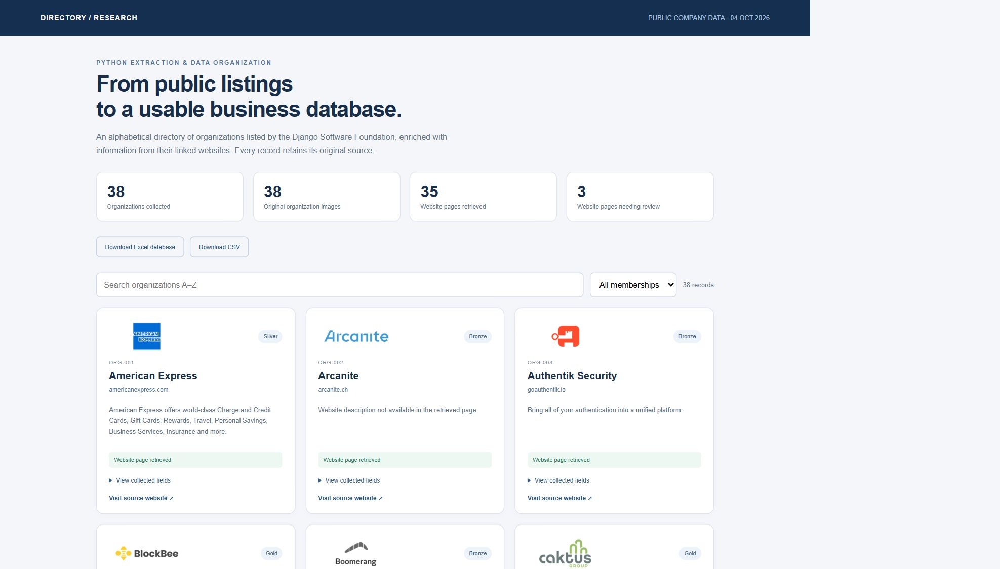
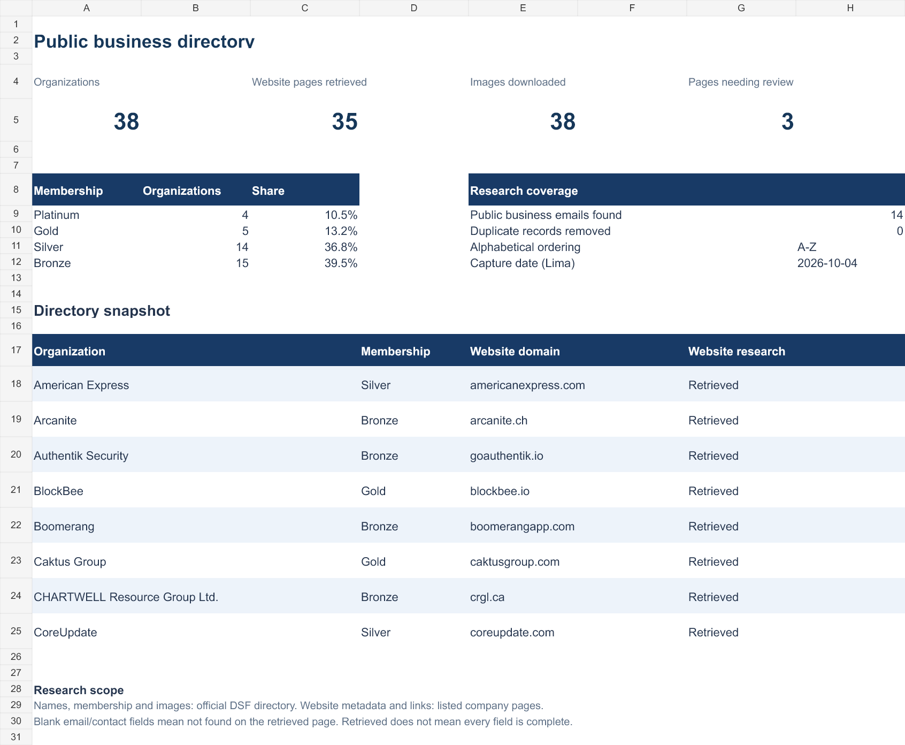

# Public Business Directory

A Python research workflow that turns public organization listings into a searchable web directory and structured Excel and CSV records.

<div align="center">
<a href="https://enybyy.github.io/business-directory/"></a>

[Excel database](outputs/Business_Directory.xlsx) · [CSV records](Business_Directory.csv) · [Upwork project](https://www.upwork.com/freelancers/eliudevelopment?p=2106929528974303232)
</div>



## Run locally

```sh
python -m http.server 8767
```

Open http://localhost:8767/business-directory/. Search by organization name and filter by membership category. Expand a record to inspect its collected fields and source links. Download the complete Excel or CSV from the page.

## From a listing to a usable database

Public directories often provide names and website links, while the details needed for research are spread across individual sites. This project preserves the original listing, visits the linked pages and gathers available business metadata into one alphabetical collection.

The current snapshot contains **38 real organizations** from the [Django Software Foundation corporate member directory](https://www.djangoproject.com/foundation/corporate-members/), captured on **October 4, 2026 (Lima)**. It includes original organization images, page titles, descriptions, generic public business emails where found, contact links and company LinkedIn URLs.

## Collection workflow

1. Read the directory membership groups and organization links.
2. Check duplicate normalized organization names and domains.
3. Retrieve linked website pages with bounded timeouts and five concurrent workers.
4. Extract page metadata and available public business links; normalize directory images.
5. Sort the records A–Z, retain source URLs and UTC capture timestamps, and export CSV.
6. Prepare the formatted Excel workbook and searchable HTML presentation from the captured records.

The spreadsheet has an overview sheet and a filterable directory with **16 columns**, frozen headers and **38 embedded logos**. The CSV contains 15 textual fields; images are represented by source URLs.



## Research scope

| Check | Snapshot result |
| --- | --- |
| Organizations collected | 38 |
| Linked pages retrieved with titles | 35 |
| Pages flagged for review | 3 |
| Generic public business emails found | 14 |
| Duplicate records removed | 0 |
| Organization images included | 38 |

Unavailable fields stay blank in the data files and are explicitly labeled in the web view. Page retrieval does not establish full verification of business information. Three linked pages need review: JBS Dev, KUWAITNET General Trading and Contracting Company, and Switchboard. Membership tiers are source categories, not quality ratings.

## Refresh the source collection

```sh
python -m pip install -r requirements.txt
python collect.py
```

The collector writes `records.json`, `Business_Directory.csv`, downloaded images and a local source snapshot. It does not automatically rebuild the styled workbook or the published HTML; those are the documented October 4 snapshot. Review changed records before republishing.

## Technology and files

- **Python:** urllib, regular expressions, concurrent futures, CSV and JSON.
- **Pillow:** normalized organization images.
- **HTML, CSS and JavaScript:** static search, category filters and expandable details.
- **Excel:** formatted workbook, overview formulas, filters and embedded images.
- **GitHub Pages:** browser access and direct file downloads without a backend.

All collected values retain their source context so the data can be checked, corrected or refreshed. The web view makes it easier to inspect a record before working with the complete spreadsheet.

Organization logos remain the property of their respective owners. This independent directory research project does not imply an affiliation with the listed organizations or the Django Software Foundation.

---

**Eliud Rojas Mendoza · Enybyy**

[GitHub](https://github.com/Enybyy) · [Upwork](https://www.upwork.com/freelancers/eliudevelopment)
